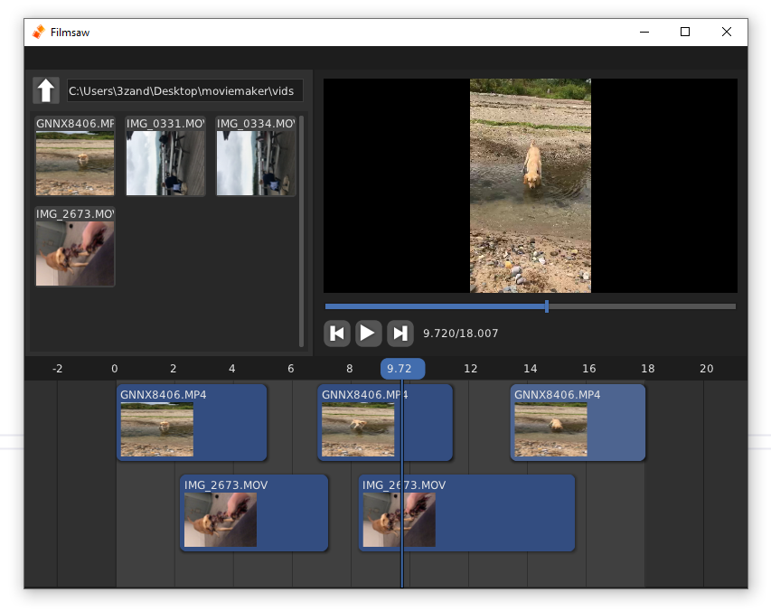

Filmsaw
=======

A barebones movie editor inspired by Windows Movie Maker. Made during the Handmade Network [Wheel Reinvention Jam](https://handmade.network/jam).

Written in C using the Sokol Libs for graphics, window setup and input and FFmpeg to actually open and render the movie files to the screen.

Building on Windows
-------------------

Install [CMake 3.10](https://cmake.org/download/) and [Visual Studio 2022](https://visualstudio.microsoft.com/vs/) then run `cmake -G "Visual Studio 17 2022" .`. Open moviemaker.sln and mash F5.

The code has been written in a cross platform-ish way but other platforms (Mac, Linux) are untested and unbuilt at this point.

